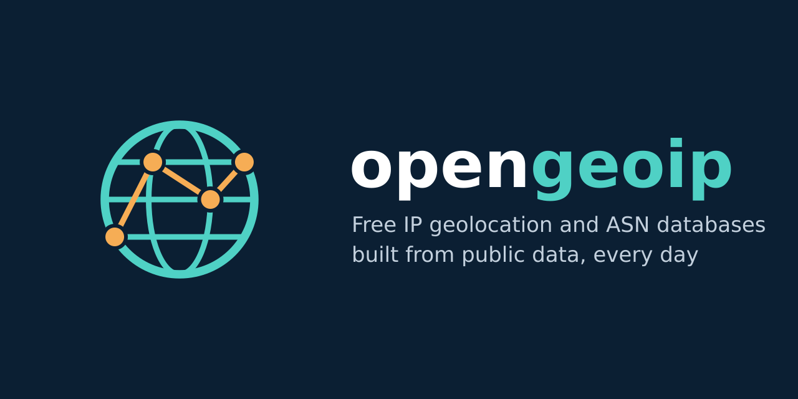

<p align="center"></p>

Free IP geolocation and ASN databases, rebuilt every day from public data only: the internet registries, BGP routes seen by RIPE RIS, RPKI, and the geofeeds operators publish for their own networks. The files are in the MaxMind DB format and work as drop-in replacements for GeoLite2.

| Repository | Content |
|---|---|
| [databases](https://github.com/opengeoip/databases) | the country, city and ASN databases, released daily, also as container images |
| [geoip-builder](https://github.com/opengeoip/geoip-builder) | the tool that builds them, to run your own |
| [geofeeds](https://github.com/opengeoip/geofeeds) | the daily catalog of RFC 8805 geofeeds it reads |

```sh
curl -LO https://github.com/opengeoip/databases/releases/latest/download/opengeoip-country.mmdb
```
